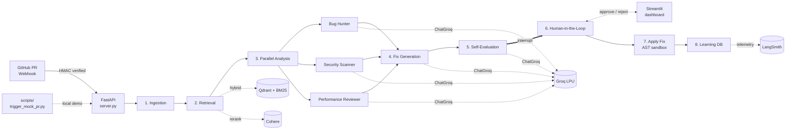

<div align="center">

# Auspex

**Reads the omens in every commit.**

A production-grade, human-in-the-loop code review pipeline. Three concurrent LLM specialists — Bug Hunter, Security Scanner, Performance Reviewer — audit every diff, then propose, self-critique, and (with your approval) apply the fixes. Powered by LangGraph and Groq.

[](https://www.python.org/)
[](https://fastapi.tiangolo.com/)
[](https://github.com/langchain-ai/langgraph)
[](https://groq.com/)
[](https://streamlit.io/)
[](https://opensource.org/licenses/MIT)

[Quick start](#quick-start) · [How it works](#how-it-works) · [Architecture](#architecture) · [API](#api) · [Configuration](#configuration) · [Security](#security)

</div>

---

## Highlights

|  |  |
|---|---|
| **Three specialists in parallel** | Bug Hunter, Security Scanner, and Performance Reviewer audit every file concurrently. Each agent is scoped tightly via a strict rubric and a category post-filter — no more performance agents reporting security issues. |
| **Cross-agent deduplication** | Issues flagged by multiple specialists are collapsed by file + normalized description, keeping the highest severity. |
| **Self-critiquing fixes** | Every proposed patch is scored across correctness, security, compatibility, and risk before it reaches a human. |
| **Human-in-the-loop** | The graph halts at a checkpoint. You approve or reject each fix in a Streamlit dashboard before anything touches the filesystem. |
| **Groq-powered** | Backed by `llama-3.3-70b-versatile` on Groq's LPU inference — typically sub-second per agent. |
| **Real cost & token tracking** | Every LLM call's `usage_metadata` is captured, summed per session, and priced against the published Groq rates. The analytics dashboard shows actual dollars spent, not zeros. |
| **Persistent sessions** | All graph state is checkpointed to SQLite via `SqliteSaver` — restart the backend and every in-flight PR is right where you left it. |
| **Hybrid retrieval** | Qdrant dense vectors + BM25 sparse, fused with reciprocal rank fusion, then reranked by Cohere. |
| **Heuristic fallback** | No API keys? The full pipeline still runs in deterministic mode so demos never break. |
| **Defense-in-depth** | HMAC-verified webhooks, per-IP rate limiting, prompt-injection sterilization, and an AST sandbox that **actually runs on every patch** — the merged file is parsed and walked before disk, and an unsafe verdict aborts the write. |
| **Safe patching** | Whitespace-tolerant three-pass matcher (`core/patching.py`) replaces naive `str.replace`. Ambiguous matches abort instead of silently corrupting the wrong line. |
| **Real GitHub integration** | When a webhook payload lacks inline files, the system falls back to PyGithub + `GITHUB_TOKEN` and fetches the PR's actual files from the GitHub API. |
| **Tested** | 37 pytest cases cover the sandbox, sanitization, heuristics, pricing, aggregation, patching, usage math, and analytics aggregation. Run `pytest tests/`. |

---

## Quick start

```bash
./setup.sh        # one-command install: venv, deps, .env, runs the test suite
./run.sh          # one-command launch: backend + dashboard, logs tailed, Ctrl-C stops both
```

That's it. `setup.sh` finds Python 3.10+, creates `.venv`, installs all dependencies, copies `.env.example` to `.env` if missing, and runs the test suite. `run.sh` boots the FastAPI backend on **http://127.0.0.1:8000**, the Streamlit dashboard on **http://127.0.0.1:8501**, waits for both to be healthy, and tails their logs in the foreground.

Override ports: `BACKEND_PORT=9000 DASHBOARD_PORT=9501 ./run.sh`

To trigger a demo PR while the system is running:

```bash
.venv/bin/python scripts/trigger_mock_pr.py
```

Open the **Live Review** tab in the dashboard. You will see three sub-agent tabs populating with issues, each with a diff, a confidence gauge, and Approve / Reject buttons. Hit **Apply approved fixes** and the patches land in `fixtures/demo_files/` (validated by the AST sandbox first).

### Manual setup

If you prefer to run the steps yourself:

```bash
python3 -m venv .venv && source .venv/bin/activate
pip install -r requirements.txt
cp .env.example .env
uvicorn server:app --reload                 # terminal 1
streamlit run dashboard/Home.py             # terminal 2
```

---

## How it works

The system is a **LangGraph state machine** with eight nodes. Steps 1–5 run autonomously; step 6 is a hard interrupt that waits for you.

```
1.  PR Ingestion           Webhook payload → changed files in state
2.  Context Retrieval      Qdrant hybrid search + Cohere rerank per file
3.  Parallel Analysis      ThreadPoolExecutor fans out to three sub-agents
        ├── Bug Hunter
        ├── Security Scanner
        └── Performance Reviewer
4.  Fix Generation         Each issue → typed Pydantic Fix proposal
5.  Self-Evaluation        Critic agent scores correctness / security / compatibility / risk
─────────── checkpoint: interrupt_before ───────────
6.  Human-in-the-Loop      Dashboard renders fixes; you approve or reject
7.  Apply Fix              AST-sandboxed patch into the working tree
8.  Learning               Rejections persisted for future model alignment
```

State is checkpointed via LangGraph's `MemorySaver` — you can resume a paused thread at any time, and the dashboard fetches its full state on demand.

---

## Architecture



---

## Tech stack

| Layer | What it does |
|---|---|
| **FastAPI 0.115** | Async backend. HMAC-SHA256 webhook auth, per-IP rate limiting, OpenAPI docs at `/docs`. |
| **LangGraph 0.2** | Durable state graph with `MemorySaver` checkpointing and `interrupt_before` for human review. |
| **langchain-groq** | Structured Pydantic outputs (JSON mode). Default `llama-3.3-70b-versatile`. Swap via `GROQ_MODEL`. |
| **Qdrant (in-memory)** | Dense vector search. `all-MiniLM-L6-v2` embeddings (384-d), mock-hash fallback if model fails to load. |
| **rank_bm25** | Sparse keyword search, fused with Qdrant via reciprocal rank fusion (k=60). |
| **Cohere Rerank v3** | Reorders the top-k retrieved chunks for relevance. Pass-through when no key set. |
| **Streamlit 1.40** | Multi-page dashboard. Sub-agent tabs, live confidence gauges, backend-fed analytics. |
| **LangSmith** | Optional run-level telemetry with cost calculation against published Groq pricing. |
| **AST sandbox** | Walks every proposed patch; blocks dangerous imports (`os`, `subprocess`, `socket`, `urllib`, `requests`) and calls (`eval`, `exec`, `open`, `system`, `popen`, `chmod`). |

---

## Project layout

```
.
├── server.py                 FastAPI entry — uvicorn server:app
├── api/
│   ├── routes.py             Sessions, decisions, resume
│   ├── webhook.py            GitHub PR webhook (HMAC verified)
│   └── analytics.py          /api/analytics/summary
├── core/
│   ├── config.py             Settings, project paths
│   ├── llm.py                Single ChatGroq factory
│   ├── sandbox.py            AST safety walker
│   ├── sanitization.py       Prompt-injection sterilization, diff clipping
│   └── rate_limit.py         Per-IP token bucket middleware
├── graph/
│   ├── builder.py            LangGraph compilation + run_review()
│   ├── state.py              GraphState TypedDict
│   └── nodes/                One file per pipeline step
├── reviewers/                Bug, Security, Performance, Critic agents
│   ├── prompts.py            Centralized prompt templates
│   └── heuristics.py         Deterministic no-LLM fallback
├── retrieval/                Qdrant + BM25 hybrid retriever, Cohere reranker
├── telemetry/                LangSmith tracer + Groq pricing table
├── models/schemas.py         Issue / Fix / FixEvaluation / ReviewSession
├── dashboard/
│   ├── Home.py               Landing page
│   ├── _styles.py            Shared CSS
│   ├── _api_client.py        Backend HTTP wrapper
│   └── pages/                Live Review, Analytics
├── scripts/trigger_mock_pr.py    Local demo trigger
└── fixtures/demo_files/          Built-in demo source files
```

---

## API

| Method | Path | Purpose |
|:------:|------|---------|
| `GET`  | `/`                              | Health probe |
| `POST` | `/webhook/github`                | GitHub PR webhook entry (HMAC verified) |
| `GET`  | `/api/sessions`                  | List active PR IDs |
| `GET`  | `/api/session/{pr_id}`           | Full `ReviewSession` (auto-bootstraps demo run) |
| `POST` | `/api/session/{pr_id}/decide`    | `{"fix_id", "decision"}` — register approve / reject |
| `POST` | `/api/session/{pr_id}/resume`    | Resume LangGraph after decisions land |
| `GET`  | `/api/analytics/summary`         | Aggregated metrics for the dashboard |
| `POST` | `/api/sandbox/validate`          | AST-validate an arbitrary code snippet |

Interactive Swagger docs: <http://127.0.0.1:8000/docs>

---

## Configuration

Copy `.env.example` to `.env`. Every variable is optional — the system degrades gracefully when keys are missing.

| Variable | Default | Purpose |
|---|---|---|
| `GROQ_API_KEY` | — | Most useful. Without it, deterministic heuristic reviewers run instead. |
| `GROQ_MODEL` | `llama-3.3-70b-versatile` | Any Groq-hosted chat model. |
| `GROQ_TEMPERATURE` | `0.1` | Sampling temperature. |
| `COHERE_API_KEY` | — | Improves reranking quality. Pass-through reranker without it. |
| `GITHUB_WEBHOOK_SECRET` | — | HMAC secret. Dev runs skip verification when unset. |
| `GITHUB_TOKEN` | — | Enables real PR file fetching when webhook payload omits inline files. |
| `LANGCHAIN_TRACING_V2` | `false` | `true` + `LANGCHAIN_API_KEY` enables LangSmith. |
| `PROJECT_ROOT` | repo dir | Override the location used for demo files + learning DB. |
| `CHECKPOINT_DB_PATH` | `{root}/auspex.db` | Path to the SQLite checkpoint file persisting graph state. |
| `RATE_LIMIT_PER_MINUTE` | `60` | Token-bucket cap per remote IP. |
| `MAX_DIFF_CHARS` | `100000` | Truncation threshold for incoming diffs. |

### Groq model options

| Model | Input $/1M | Output $/1M | Best for |
|---|---:|---:|---|
| `llama-3.3-70b-versatile` *(default)* | 0.59 | 0.79 | Highest quality structured output |
| `openai/gpt-oss-120b` | 0.15 | 0.75 | Strong reasoning, mid-tier cost |
| `meta-llama/llama-4-scout-17b-16e-instruct` | 0.11 | 0.34 | Fast and economical |
| `llama-3.1-8b-instant` | 0.05 | 0.08 | Cheapest, demo-quality |

---

## Security

This is not a side-project review bot — it writes to disk on your machine. Five guardrails are layered in:

1. **HMAC-SHA256 webhook verification** — constant-time comparison against `GITHUB_WEBHOOK_SECRET`.
2. **Per-IP rate limiting** — token bucket middleware, default 60 req/min.
3. **Prompt-injection sterilization** — incoming text is scanned for known injection phrases (`ignore previous`, `system override`, ...) and clipped/wrapped before reaching the LLM.
4. **AST sandbox, enforced** — `apply_fix_node` parses the post-patch file with `safe_sandbox_compile`. Imports of `os` / `subprocess` / `socket` / `urllib` / `requests` and calls to `eval` / `exec` / `open` / `system` / `popen` / `chmod` cause the patch to be rejected and recorded in session metadata under `rejected_unsafe_fixes`.
5. **Safe patching** — `core/patching.py` uses a three-pass matcher (exact → whitespace-normalized → fuzzy with confidence threshold). Ambiguous matches abort instead of silently corrupting the wrong line.

In addition, large diffs are clipped to `MAX_DIFF_CHARS` before they are sent anywhere, and every approved fix's blast radius is bounded by the AST walker's allowlist.

---

## Development

```bash
pytest tests/         # unit tests (37 cases)
ruff check .          # lint
black .               # format
```

`pyproject.toml` configures ruff, black, and pytest for a 100-column line limit and Python 3.10 target.

### What's tested

| Module | Coverage |
|---|---|
| `core/sandbox` | dangerous-import + dangerous-call rejection, safe-code acceptance, syntax-error reporting |
| `core/sanitization` | injection sterilization, oversized-diff truncation |
| `core/patching` | exact, whitespace-normalized, and fuzzy matching; ambiguity aborts |
| `core/usage` | cost math, merge semantics, unknown-model handling |
| `reviewers/heuristics` | each agent type returns type-correct findings |
| `reviewers/_aggregation` | category filter drops drift, dedupe collapses by file+description |
| `telemetry/pricing` | per-model rates, default fallback, proportionality |
| `api/analytics` | end-to-end summary aggregation across mock sessions |

---

## Contributing

PRs welcome. The pipeline is intentionally modular:

- **A new specialist agent?** Drop a file in `reviewers/`, add it to `reviewers/__init__.py`, and submit it from `graph/nodes/analysis.py`.
- **A new pipeline step?** Create `graph/nodes/<your_node>.py` and wire it in `graph/builder.py`.
- **A new dashboard view?** Add a numbered file in `dashboard/pages/` — Streamlit auto-detects it.

---

## License

MIT.
